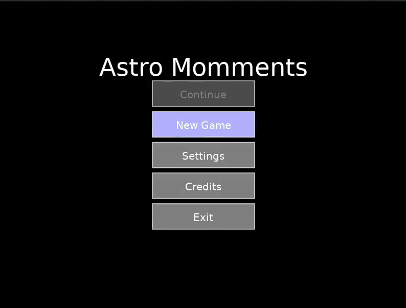
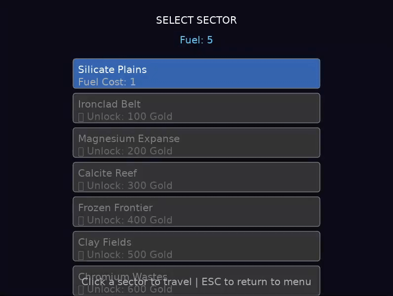
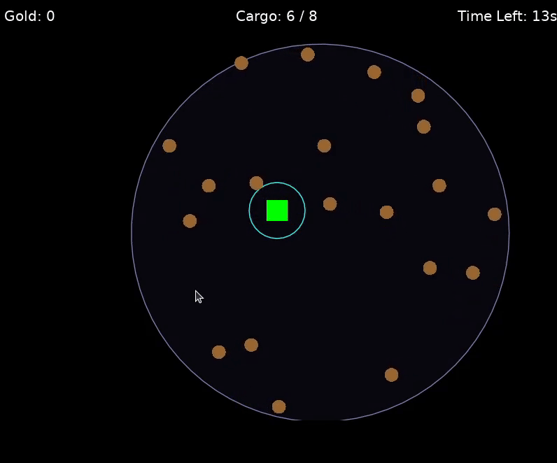

# Astro Moments Development Blog

Welcome to the development blog for Astro Moments! Here, I'll be sharing updates, insights, and behind-the-scenes looks at the development process of the game. Stay tuned for regular posts about new features, design decisions, and challenges faced along the way.

## Day 1 (December 4, 2025)

**Drinks Consumed:** 1 Michelada (Modelo Especial)

I spent a lot of time thinking through some ideas for a game. I want to make a game that has an easy pace but is still engaging. It also needs to be on the easier side to develop since I'm doing this solo and new to game development.

First thing was choosing a development framework. I've been falling in love with the Lua programming language recently. It's simple, lightweight, and allows me to be flexible. This doesn't deminish my love for Python, but I think Lua is a better fit for game development. After some research, I decided to use the LÖVE framework. It seems beginner-friendly and has a supportive community. I watched and followed a few tutorials on YouTube to get a feel for how it works. I purchased [Challacade's LÖVE 2D course](https://www.udemy.com/share/101WsA3@iNimXY79qiKfz1SgmWI2tYwmUKKID22MYflhy95BMI4o3CZ0dEDKpS6ykbdbHfc=/)on Udemy to help me get started and followed his [playlist on YouTube](https://www.youtube.com/playlist?list=PLqPLyUreLV8DrLcLvQQ64Uz_h_JGLgGg2) as well. These gave me a solid foundation to build upon and my confidence to start coding my own game.

I remember a game is finsihed recently called [Far Fishing](https://store.steampowered.com/app/3723470/Far_Fishing/) that had a relaxing vibe to it. I want to capture that same feeling in my game. I wrote a few things I really enjoy about that game:

- Relaxing gameplay loop
- Simple mechanics
- Incremental progression (upgrades, new areas, etc.)

I want to incorporate these elements into my game.

With these ideas in mind, I started brainstorming some game concepts.

I started with what I'm calling the Micro Game Loop:

1. Player plays through the map, collecting resources and avoiding obstacles.
1. The items being captured must be within a "ring" (capture area) and the player must keep that item within the ring for a few seconds to successfully capture it.
1. Player cashes out resources for upgrades.

This loop will be the core of the gameplay experience. I want to make sure it's engaging enought to be entertaining but not too complex or overwhelming.

Next, I starting thinking about the Macro Game Loop:

1. Player selects a map to play on.
1. Player plays through the map, collecting resources (Micro Game Loop).
1. Player cashes out resources for upgrades.
1. Player unlocks new maps and areas to explore (via resources collected).
1. Player can purchase upgrades to improve their abilities and make resource collection easier (via resources collected).
1. Player repeats the process, gradually unlocking new content and improving their capabilities.

This loop will provide a sense of progression and long-term goals for the player. I want to make sure there's a good balance between short-term and long-term objectives to keep players engaged.
Experience wise, the player will feel a sense of relaxation and accomplishment as they explore new areas, collect resources, and improve their abilities. At the start, the game will feel a bit difficult compare to later on when the player has acquired upgrades and unlocked new maps. The pacing will be slow and steady, allowing players to take their time and enjoy the experience without feeling rushed or pressured.

With these loops in mind, I started to hash out the [Game Design Document (GDD)](/docs/ASTRO_MOMENTS_GAME_DESIGN_DOCUMENT.md) to flesh out the details of the game. This document will serve as a roadmap for development and help me stay focused on the core mechanics and features of the game.

Additionally, I wanted to put my guardrails in place early on. First and foremost, participating in the game jam is an opportunity to learn and grow as a developer. I want to focus on creating a game that is fun and engaging, rather than trying to make something overly complex or ambitious. I will prioritize simplicity and clarity in my design choices, ensuring that the core mechanics are easy to understand and enjoyable to play. With the main focus being about learning, I am putting less pressure on myself to create a "perfect" game. Instead, I will embrace the iterative process of game development, allowing room for experimentation and improvement. Also, I will only use AI when absolutely necessary. If I need help, I will look my own resources first (such as the games I build while learning Lua and LÖVE). Next, I will turn to online resources, tutorials, and forums to find solutions. I will always look at LOVE's documentation first before anything else. Only after exhausting these options will I consider using AI tools to assist with specific challenges or tasks (such as help me with math problems, debugging code, etc.). This way, I can ensure that I am actively learning and developing my skills throughout the process. Lastly, if I use AI tools, I will not copy and paste any code directly into my project. Instead, I will use the AI-generated content as a reference or guide, and then write my own code based on that information. This will help me internalize the concepts and techniques being discussed, rather than simply relying on pre-written solutions. The only expections to this rule will be when I know the code well and just need to save time (such as moving code around, formatting, etc.).
AI is a powerful tool, but I want to make sure that I am actively engaging with the development process and building my own skills.

## Day 2 (December 5, 2025)

**Drinks Consumed:** 1 Michelada (Modelo Especial)

Today, I started setting up the project structure and getting familiar with the LÖVE framework. I created a basic project folder and set up version control using Git. This will help me keep track of changes.

I focused on implementing the core mechanics of the Micro Game Loop. I started with the ship movement and fish spawning systems. I created a simple square that can move around the screen using keyboard inputs. I also implemented a basic fish spawning system that generates fish at random intervals.

I also worked on the collection ring mechanic. I created a circular area around the ship that represents the collection field. When a fish enters this area, a collection meter starts to fill up. If the fish stays within the ring long enough, it gets collected.

I ran into my first set of challenges, and it all around math. I haven't done much around math since high school, and even my skills then were lacking. I struggled with calculating distances and angles for the collection ring and fish movement. To overcome this, I look at some of the math I did in the "tutorial" games I created and a few examples only. To be honest, I was lost. Cosin, Sine, Tangent, etc. - I remembered a bit, but knew I needed help. I leveraged AI to help me understand the concepts better. I asked for explanations and examples of how to calculate distances and angles in a 2D space. This helped me grasp the concepts and apply them to my game.

Maybe I should join a math jam one day...

After a few hours that Friday evening, I managed to get the basic mechanics working. The ship can move around, fish spawn randomly, and the collection ring mechanic is functional. It felt great to see my ideas come to life, even in this early stage.

## Day 3 (December 6, 2025)

**Drinks Consumed:** Sips of a Starbucks Iced Shaken Espresso

Today, I updated the [README File](../README.md) to include more information about the game and its current state.

I didn't spend much time on the game today because it's the weekend and that time is reserved for my wife and son. However, I did manage to brainstorm some ideas for the next steps in development.

## Day 4 (December 8, 2025)

**Drinks Consumed:** 1 Starbucks Iced Shaken Espresso, 1 Starbucks Matcha Latte, 1 Iced Milk Tea, 1 Michelada (Modelo Especial)

Big decision. Yesterday, I realized that I was recreating [Far Fishing](https://store.steampowered.com/app/3723470/Far_Fishing/) a bit too closely. While I love that game, I want to make sure that my game has its own unique identity. So, I decided to pivot the game's theme from fishing to space exploration. The core mechanics will remain similar, but instead of collecting fish, the player will be collecting space debris and resources.

Why space? Why not. Maybe it's because I suddently went down a rabbit hole around space-themed Anime (like "Outlaw Star" and "Cowboy Bebop").

A lot of what I have existing can stay the same. For example, I added movement logic to the ship. Change direction slows the ship down a bit to simulate inertia in water. This is basically the same feeling in space. I just need to change the names of some variables to reflect the new theme.
I used AI to do that quickly. I don't need to spend the time finding and replacing.

I also changed the name from "Minnow Minutes" to "Astro Moments". I like the play on words with "Astro" (relating to space) and "Moments" (short, enjoyable experiences). It captures the essence of the game - quick, relaxing sessions of space exploration.

I started working on game states, adding a menu screen and placeholders for other screens like settings and credits. This will help me organize the game's flow and make it easier to add new features later on. I also began implementing the random buffs that the player can choose from whenever they set out on a new mission (before the Map Selection screen). These buffs will provide temporary advantages during the mission, adding an extra layer of strategy to the gameplay.

I also added some more variables to the ship, such as cargo capacity and fuel (this will act as the travel currency).

Tons of progress on the random buff selection screen. The player can now choose from three random buffs before starting a new mission. Each buff has a name, description, and value. Once a buff is selected, it's applied to the player's ship for the duration of the mission (until their fuel runs out).

Also, I implemented the Map Selection screen. The player can now choose from different maps to explore, each with its own rewards. The maps are unlocked based on the player's progress, providing a sense of progression and accomplishment.

To end the night, I worked on the Cashout screen. After completing a mission, the player can cash out their collected resources for gold. The total value is calculated based on the types and quantities of resources collected, as well as any active buffs that may increase the value. Once cashed out, the player can use their gold to purchase upgrades and unlock new maps.

Additionally, I started breaking my code up into modules to improve organization and maintainability. This will make it easier to manage the codebase as the project grows. I saw this example in Challacade's course and thought it was a good idea; I just took it to the next level from my previous experience doing web development.

I'm also just realizing that the repo and the GDD have "Moments" misspelled as "Momments". I'll need to fix that later.
